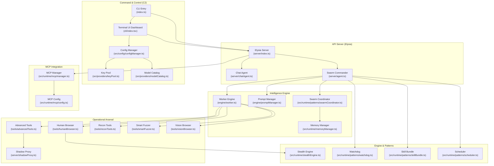
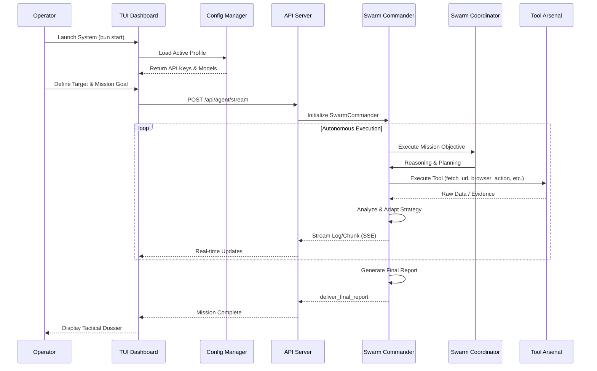
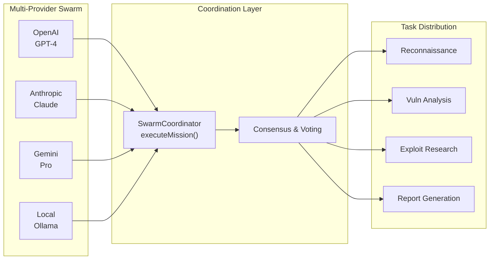
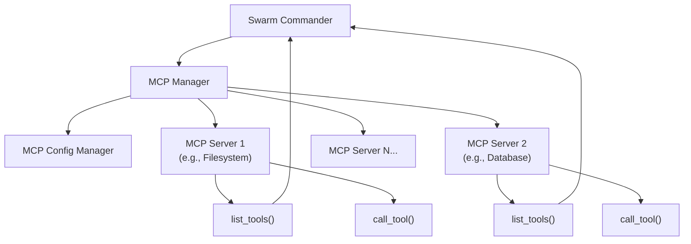

# REDLOCK AuditorAi v2.0.0

## Autonomous Security Intelligence & Swarm Orchestration Platform

REDLOCK AuditorAi is an Autonomous Intelligence Platform designed for Advanced Red Teaming, Vulnerability Research, and Systematic Auditing. It utilizes a **Decentralized Swarm** architecture capable of autonomous decision-making and full-scale operations.

> **[!] TACTICAL ADVISORY**
> This system is engineered exclusively for authorized security professionals and auditors.
> Agents operate with Full Autonomy. Use with maximum caution.

---

## 🏗️ System Architecture

The system features a decoupled architecture separating the User Interface (TUI), Policy Control (Config Manager), and Operations (Swarm Engine).



---

## 🔄 Operational Workflow

The operational flow of AuditorAi from mission initiation to tactical report delivery.



---

## 🧠 Swarm Intelligence Concept



---

## 🛠️ MCP (Model Context Protocol) Integration

REDLOCK AuditorAi supports MCP for connecting to external tools and services.



---

## ✨ Key Features (2026 Edition)

### Core Capabilities

* **Multi-Model Swarm Intelligence**: Utilize multiple AI Providers simultaneously for consensus-based analysis
* **Full Autonomy Agent**: Agents independently select tools and plan strategies without human intervention
* **MCP Integration**: Connect to Model Context Protocol servers for extended capabilities
* **Advanced TUI Dashboard**: Ink-based Terminal UI with real-time streaming logs
* **Elysia API Server**: RESTful API with Server-Sent Events (SSE) for streaming responses

### Security & Stealth

* **Stealth Engine**: Tactical headers and proxy rotation for detection evasion
* **Shadow Proxy**: MITM proxy for traffic interception and modification
* **Key Pool Management**: Manage multiple API key sets with automatic rotation
* **Profile System**: Manage multiple profiles for different providers

### Training & Research

* **Integrated Security Lab**: 13-level vulnerability lab (Port 8080) for hands-on training
* **Prompt Injection Lab**: Test prompt injection attack vectors
* **Obsidian Integration**: Record findings and create attack maps in Obsidian vault

---

## 🚀 Technology Stack

| Component | Technology |
|-----------|------------|
| **Runtime** | [Bun](https://bun.sh) (100% Native TypeScript/JavaScript) |
| **TUI Framework** | [Ink](https://github.com/vadimdemedes/ink) (React-based Terminal UI) |
| **API Server** | [Elysia](https://elysiajs.com) (TypeScript web framework) |
| **AI Providers** | Multi-Model (OpenAI, Anthropic, Gemini, Ollama/Local) |
| **Browser Automation** | Playwright (Chromium) with Anti-Detection |
| **MCP Support** | @modelcontextprotocol/sdk |
| **State Management** | Swarm Patterns (Scheduler, Watchdog, Skill Bundle) |

---

## 📦 Installation & Quick Start

### Prerequisites

- [Bun](https://bun.sh) runtime installed
* API keys for at least one AI provider (OpenAI/Anthropic/Gemini)

### 1. Install Dependencies

```bash
bun install
```

### 2. Configure Profiles

Create a `.env` file or use the TUI:

```bash
# Minimal .env example
OPENAI_API_KEY=sk-your-key-here
DEFAULT_PROVIDER=openai
```

### 3. Start the System

#### Option A: CLI Mode (Recommended)

```bash
bun start
```

Launches the animated CLI → TUI Dashboard

#### Option B: API Server Only

```bash
bun run server
```

Starts Elysia API server on port 4040

#### Option C: TUI Only

```bash
bun run tui
```

Directly launch Terminal UI

---

## 💻 Usage Guide

### TUI Dashboard Navigation

```
Main Menu:
├── [ START MISSION ] → Start new mission
├── [ CONFIGURE ]    → Manage Profiles (API Keys, Models)
├── [ LAB MODE ]     → Security Lab training
└── [ EXIT ]         → Exit system
```

### Profile Management

1. Select **CONFIGURE** from main menu
2. Use **Arrow Keys / Tab** to navigate
3. Fill in the details:
   * Profile Name
   * Provider (openai/anthropic/gemini/ollama)
   * API Key
   * Model (e.g., gpt-4, claude-3-opus)
4. Press **[ SAVE ]** to save
5. Press **[ ACTIVATE ]** to use the profile (name turns green)

### Starting a Mission

1. From TUI, select **START MISSION**
2. Specify Target (URL or IP)
3. Specify Goal (audit objective)
4. Press Enter to start the mission

The Agent will operate autonomously and stream results in real-time via SSE

### API Usage (Programmatic)

```bash
# Start a mission via API
curl -X POST http://localhost:4040/api/agent/stream \
  -H "Content-Type: application/json" \
  -d '{
    "url": "https://target.com",
    "goal": "Find SQL injection vulnerabilities",
    "provider": "openai",
    "model": "gpt-4",
    "browserVisible": false
  }'
```

---

## 📊 Agent Tool Arsenal

| Tool | Description | Category |
|------|-------------|----------|
| `fetch_url` | Visit URL and return page snapshot | Recon |
| `dns_recon` | DNS reconnaissance on host | Recon |
| `http_header_audit` | Audit HTTP security headers | Security |
| `ssl_inspect` | Inspect SSL/TLS certificate | Security |
| `secret_scanner` | Scan for leaked secrets/keys | Security |
| `port_probe` | Scan common ports | Recon |
| `web_spider` | Map website structure | Recon |
| `browser_action` | Interactive browser control | Browser |
| `wayback_lookup` | Historical URLs via Wayback Machine | OSINT |
| `record_vulnerability` | Record vuln in persistent memory | Reporting |
| `deliver_final_report` | Generate tactical dossier | Reporting |
| `get_technique_blueprint` | Get security technique research | Research |

### Advanced Tools (tools/ directory)

- **advancedTools.ts**: Exploit forging, payload generation
* **humanBrowser.ts**: Stealth browser with Playwright
* **reconTools.ts**: Network reconnaissance tools
* **smartFuzzer.ts**: Automated vulnerability fuzzing
* **visionBrowser.ts**: Visual UI analysis with OCR
* **reverseEngineer.ts**: Code analysis and reverse engineering
* **redteam.ts**: Red team attack simulations
* **reportForge.ts**: Professional report generation

---

## 🧪 Security Lab (Training Mode)

REDLOCK AuditorAi includes a built-in security training lab:

```bash
bun run lab
```

The Lab consists of 13 levels (levels 1-13) for hands-on practice:
* SQL Injection
* XSS (Stored/Reflected/DOM)
* CSRF
* SSRF
* IDOR
* Broken Access Control
* Security Misconfiguration
* And more

---

## 📂 Project Structure

```
REDLOCK-AuditorAi/
├── index.ts                    # CLI Entry Point
├── server/
│   ├── index.ts               # Elysia API Server
│   ├── agent.ts               # SwarmCommander Runtime
│   ├── chatAgent.ts           # Chat Session Manager
│   ├── shadowProxy.ts         # MITM Proxy
│   └── tools.json             # Tool Definitions
├── cli/
│   ├── index.tsx              # Ink TUI Dashboard
│   ├── dashboard.tsx          # Dashboard Components
│   └── components/            # UI Components
├── engine/
│   ├── promptManager.ts       # Prompt Templates
│   ├── worker.ts              # Worker Engine
│   ├── vulnerabilityMemory.ts # Vuln Database
│   └── exploitForge.ts        # Payload Generator
├── tools/                     # Agent Tool Arsenal
│   ├── advancedTools.ts
│   ├── humanBrowser.ts
│   ├── reconTools.ts
│   └── ...
├── src/
│   ├── config/                # Configuration
│   │   ├── configManager.ts
│   │   ├── keyPool.ts
│   │   └── modelCatalog.ts
│   ├── runtime/               # Core Runtime
│   │   ├── logger.ts
│   │   ├── stealthEngine.ts
│   │   ├── memoryManager.ts
│   │   ├── mcp/               # MCP Integration
│   │   └── patterns/          # Swarm Patterns
│   └── providers/             # AI Providers
│       ├── keyPool.ts
│       └── modelCatalog.ts
├── lab/                       # Security Lab
│   ├── labSystem.ts
│   └── levels/                # 13 Training Levels
└── engine/                    # Security Engines
```

---

## 🔧 Development Commands

```bash
# Development mode with hot reload
bun run dev

# Type checking (MANDATORY before commits)
bun run check

# Run any TypeScript file directly
bun file.ts

# Clean install
bun run clean

# Lab mode
bun run lab
```

---

## 🎯 Design Principles

1. **Full Autonomy**: Agents have 100% decision-making authority with no hardcoded restrictions
2. **Swarm Intelligence**: Utilize multiple AI models simultaneously for consensus
3. **Stealth First**: All requests use tactical headers and proxy rotation
4. **Extensible**: MCP support for unlimited tool expansion
5. **Persistent Memory**: Record findings and learn from previous missions
6. **Bun Only**: Uses Bun runtime exclusively (faster and more modern than Node.js)

---

## ⚠️ Compliance and Liability

This software is created solely for research and authorized security testing purposes. The developers assume no liability for any damages resulting from unauthorized or illegal use.

**Operational Precision. Swarm Intelligence. Zero Summary Laziness. Full Autonomy.**

---

## 📝 Version History

### v2.0.0 (2026-04-23)

- ✅ Elysia API Server with SSE streaming
* ✅ MCP (Model Context Protocol) integration
* ✅ SwarmCoordinator with multi-provider support
* ✅ Enhanced TUI with Ink
* ✅ Shadow Proxy for MITM capabilities
* ✅ 13-level Security Lab
* ✅ Prompt injection lab
* ✅ Obsidian integration for findings
* ✅ Advanced tool arsenal (15+ tools)

### v1.x (Legacy)

- Initial release with basic agent capabilities

---

## 📧 Contact & Support

* **Repository**: [github.com/JonusNattapong/RedLock](https://github.com/JonusNattapong/RedLock)
* **Issues**: [Report bugs](https://github.com/JonusNattapong/RedLock/issues)
* **Author**: JonusNattapong

---

**Last Updated**: 2026-04-23
